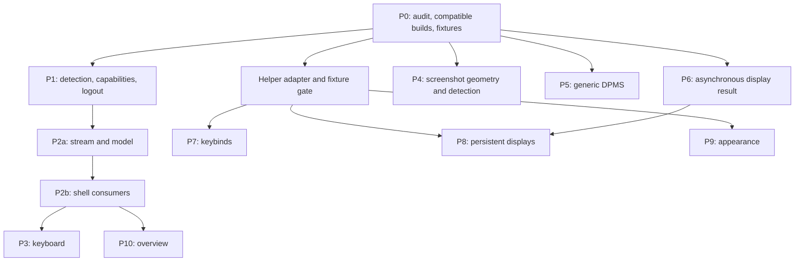

# Aqueous integration: repository implementation plan

Status: implemented in the working tree against Aqueous master
`2d8b07fb1ff2354ea0c3acddd5cc84ceb823d6eb`, with the limitations and test evidence
recorded in [Aqueous integration](aqueous.md). No commits or PRs were created.
Audit and implementation date: 2026-09-05.

This document retains the implementation sequence, runtime/configuration contracts,
complete batch schema, and Wayland XML from the planning audit. The initial audit
table and work-package instructions below are historical planning context. The
helper sources have now been inspected and built, and real runtime fixtures have
been captured. In particular, the pinned helper cannot persist output scale,
enablement or adaptive-sync changes through its monitor adapter, and cannot safely
represent EDID-only monitor edits. Those portions of P8 need an Aqueous follow-up.

The implementation follows the direct QML service design: `AqueousService.qml`
owns capability discovery, the single watcher, atomic reducer, reconnect lifecycle
and typed CLI actions. `AqueousConfigService.qml` handles stdin helper requests.
Standalone screenshot and keybind adapters remain in their existing core packages;
there is no `core/internal/aqueous` package or Aqueous server route. See
[implementation notes](aqueous.md) for the direct parser boundary and the CLI's
lack of an atomic expected-session command check.

## Scope and audited baseline

Implement DMS P0–P10. Keep generic DPMS and display-result fixes independently reviewable. DankLinux-Docs, packaging, plugin registry, and optional Quickshell bindings belong in their owning repositories. Proposed PR boundaries below do not authorize creating PRs, committing, or pushing.

Read `AGENTS.md` and `CONTRIBUTING.md` again at implementation time. Use Theme tokens, Dank wrappers, guard clauses, scoped Log, and existing I18n terms. Do not manually edit translation catalogs, generated mocks, or embedded shell output. Current hooks also enforce an I18n term freeze; inspect it before adding messages.

| Component | Evidence from this audit | Consequence |
| --- | --- | --- |
| DMS | `5baef07048656867a374d210d4305911b8a76e4f`; clean before this plan | Rebase the handoff's historical audit onto this revision. |
| Common QML | Gitlink `26396ce432d6c71c3f5367438f96f4a8d667e160`; submodule uninitialized | Initialize the pinned submodule before inspecting shared Proc/Compositor behavior or running UI checks. |
| Installed Quickshell | `noctalia-qs 0.0.12 (revision , distributed by Arch Linux)` | Exact source revision and compatibility with this DMS checkout remain unverified. |
| Installed Aqueous | `aqueous -version` reports `aqueous 0.4.8 +xwayland` | This version is an observation, not a supported minimum. |
| Installed aqueousctl | Help lists windows/inspect/scene/outputs/overlay-planes/layout/cursor; `shell capabilities --json` exits 2 with usage | Installed CLI cannot exercise the supplied shell contract. |
| Installed helper | `aqueous-config version` returns `{"ok":true,"protocol":1,"version":"0.1.0"}`, without capabilities | Obtain the actual 0.7.1 capability-aware build and pin its revision. |
| Toolchain | `core/go.mod` requires Go 1.26.5; Go was not found on PATH; Qt 6 qmllint/qmltestrunner/qmlformat are installed | Provision the prescribed development environment before implementation checks. |

The previous DMS revision `59a03f450dbf5ae5dd8aa2cd301b89d9293c68a3` is historical, not a released minimum. No compatible isolated Aqueous session, real snapshot/delta fixtures, helper snapshot, hardware tests, or application test suite was run during this planning audit.

Source inspection confirmed:

- No Aqueous integration was found under quickshell, core, or docs.
- `CompositorService.qml` already detects the Wayland socket owner before environment fallbacks. Extend that mechanism.
- `SessionService.logout()` starts UWSM and immediately calls `_logout()`; UWSM output/failure handlers can call it again. Detected Aqueous would otherwise reach `HyprlandService.exit()`.
- `DisplayConfigState.backendWriteOutputsConfig()` still invokes `WlrOutputService.applyOutputsConfig()` then `finish(true)`. The high-level helper drops the callback, although lower-level `applyConfiguration()` has one. This is source evidence; runtime reproduction remains required.
- Core screenshot detection still uses environment candidates; it needs socket-owner precedence independently of QML.
- Taskbar/dock consumers both call window methods and directly assign `minimized`. Adding rows to a model alone will not make actions correct.
- `commands_keybinds.go` removes a replaced key before `SetBind`. The writable provider API has no generation argument for removal. Aqueous requires an atomic helper request carrying the generation observed by the UI.
- Installed Quickshell IO metadata exposes QString reads and a SplitParser delimiter, but no configurable byte bound. It does not prove bounded buffering or strict UTF-8 handling. Native toplevel identity correlation is also unverified.

## Architecture decisions and P0 gates

Use one `AqueousService.qml` singleton, gated on positive session detection. Expose detection, capabilities, model availability, session/sequence, seat selection, and command errors separately. Never spawn helpers merely because a widget imports the service.

Prefer one direct `aqueousctl shell watch --json` process owned by that service. Use argument-array processes for explicit actions. No snapshot polling, heartbeats, per-widget watchers, background configuration polling, or quiet-stream timeout.

Use Quickshell Process and SplitParser with the supported aqueousctl adapter.
The CLI enforces bounded UTF-8 protocol batches; SplitParser reassembles its NDJSON
and QML validates complete record sizes, schema and continuity. The installed
Quickshell parser has no pre-delimiter byte bound or raw UTF-8 error reporting,
so that part of the contract is delegated to aqueousctl. Do not claim independent
protection from a faulty CLI's unterminated or invalid-byte output. A future parser
capability can close that gap without moving compositor state or actions to core.
Test the production QML reducer and actual Process lifecycle.

Default to Aqueous's authoritative windows/workspaces and ID-based actions. A native identity bridge is optional only after confirming the exact ext-foreign-toplevel identifier on the tested Quickshell build. Never match title, app ID, window order, connector reuse, or workspace display number to establish identity.

Publish each accepted transaction as one model revision so consumers cannot observe half a move/removal. A facade may expose existing appId/title/activated/state fields and methods, but action setters must route through capability-aware commands. Alternatively replace affected direct mutations with shared CompositorService action methods. Preserve existing backends and validate stale actions against both captured session and current entity membership.

Persistent settings use one shared aqueous-config adapter with version/capability discovery, stdin JSON, validation, and the UI's retained generation. Do not introduce a TOML parser/writer. Keep the runtime shell service independent of helper availability.

## Delivery sequence



This expresses dependencies, not a requirement for parallel agents. P4 can use a fresh standalone snapshot without waiting for consumer wiring; it still needs verified socket detection and the same validated shell geometry contract.

### P0 — Finish prerequisite audit and capture fixtures

1. Initialize the pinned common submodule without updating its revision. Inspect its applicable instructions, Proc implementation and shared Compositor API. Pin Quickshell source/package revision and DMS daemon used for UI tests.
2. Obtain the Aqueous working-tree patch set implementing this contract and helper 0.7.1. Record source commits, dirty patch identifiers and binary versions. Installing similarly numbered builds is not evidence of capability.
3. Launch an isolated internal-policy Aqueous session with private runtime/config directories and explicit Wayland display. Inspect the Aqueous test harness before using it; never run action tests against the user's session.
4. Capture sanitized capabilities, initial snapshot, deltas, command results/errors, helper version and helper snapshot. Preserve all identity relationships when redacting titles/app IDs/paths. Capture actual helper requests from `plugin/helper/` and `dms-plugin/README.md`; document adapter reports, retry flags and generation types.
5. Resolve the transport gate above and test native identity only if considering correlation. Record the final implementation file map and where executable fixtures/tests will live.

Exit: exact dependency manifest, usable isolated session, fixture set, transport choice, complete helper request examples. P0 is partially complete from this audit; those remaining tasks are not checked off.

### P1 — Detection, capability lifecycle and logout

Proposed PR: `compositor: recognize Aqueous and support session exit`.

Targets: `quickshell/Services/CompositorService.qml`, `SessionService.qml`, new `AqueousService.qml`; inspect shell/service initialization and shared Proc before wiring startup.

- Add `isAqueous`, socket-owner mapping for `aqueous`, and verified desktop/session fallbacks using existing precedence. A parent compositor's inherited variables must not override the socket owner.
- Probe `aqueousctl shell capabilities --json` only after detection. Reject unsupported schema; classify executable/protocol absence without rapid retries. Preserve runtime observation when commands are unsupported.
- Dispatch direct logout as `aqueousctl session exit --json`, checking exit status and accepted JSON. EOF alone is not acceptance. Old CLI or locked-session failure must not fall through to Hyprland.
- Preserve custom actions and UWSM precedence. Fix single-dispatch UWSM control flow: wait for completion before any fallback, and ensure output plus exit callbacks cannot trigger duplicates. Make this small generic fix separately reviewable if necessary.

Verify direct/nested/UWSM/custom sessions, missing/old CLI, schema mismatch, lock, command failure and acknowledged orderly exit. Verify no Aqueous executable is needed for other compositors.

### P2a — Live stream, reducer and command layer

Proposed PR: `compositor: add the Aqueous live state service`. Depends on P1.

Targets: AqueousService, a pure reducer module or core package selected at P0, and transport-specific fixtures/tests.

- Store IDs and decimal sequences as strings. Entity key is session + kind + id. Do not parse sequences through Number, including comparison/sorting helpers.
- First record must be a snapshot. Require supported schema, valid envelope/entities, matching session and exact delta base sequence. Sequence jumps are valid. Replace upserts completely, stage all changes/removals, validate references in the completed state, then publish once.
- Keep missing optional fields cleared and ignore additive unknown fields. The supplied schema permits only the listed entity kinds; do not silently accept new kinds without an explicit compatibility decision.
- Validate invariants beyond JSON schema: exactly the fixed session entity, unique entity keys, usable seat defaults, reference integrity and effective keyboard indices. Resolve any uncertain invariant against real fixtures; do not require contiguous sequences.
- Bound incomplete byte buffers, decoded payloads, pending operations and diagnostic output. On malformed/truncated data, wrong continuity or EOF, mark unavailable immediately and disable old-ID actions.
- Suggested reconnect policy: one-shot delay starting at 500 ms, doubling to a 30 s cap with up to 20% jitter within the cap. Avoid resetting to minimum after repeated snapshot-then-EOF failures; reset only after sustained healthy connection. Permanent missing/unsupported prerequisites wait for explicit retry or backend/session change.
- Use generation tokens to discard old process callbacks after backend changes. Stop/reap children, release command handles and cancel retry timers on teardown.
- Commands recheck capabilities, lock, session and target membership immediately before dispatch. Bound concurrent requests; no blind retry after timeout. Use authoritative subsequent state to reflect mutation outcomes.

Verify fragmented/coalesced records, split Unicode, invalid UTF-8, payload boundary and missing delimiter, malformed envelopes/entities, >2^53 sequences, jumping sequences, full replacement, reset, delta mismatch, restart/session reuse, same-batch moves/removals, command failures and cleanup. Assert one watcher and zero idle polling.

### P2b — Workspace, window and focused-output consumers

Proposed PR: `compositor: integrate Aqueous workspaces and windows`. Depends on P2a.

Targets discovered here:

- `CompositorService.qml`: sortedToplevels, equivalence checks, activate/toggle/minimize helpers, workspace/output filtering, fullscreen and overlap queries, focused screen.
- `Services/BarWidgetService.qml`: selected-output routing.
- `Modules/DankBar/Widgets/WorkspaceSwitcher.qml`, `RunningApps.qml`, `AppsDock.qml`, and `FocusedWindowContextMenu.qml`.
- `Modules/Dock/DockApps.qml`, `DockAppButton.qml`, `DockContextMenu.qml`, and `DockBody.qml`.
- Trace launcher window actions and workspace-overlay consumers from the shared interfaces after model wiring; do not assume every consumer uses sortedToplevels.

Use runtime workspace IDs for activation, membership and moves; resolve output IDs to connector names. Seat-selected output remains correct for empty workspaces and layer focus. Explicit seat identity is required for focus actions; an ambiguous default disables the action or requests seat selection.

Honor skip_taskbar/skip_switcher, minimized, visibility, active workspace and per-window eligibility. Hidden/minimized windows may remain actionable where the existing UI intentionally restores them; visibility must not be mistaken for occlusion. Preserve app grouping/icon lookup as presentation only, using XWayland class when app_id is null.

Wire every existing activation/close/state/move affordance to the authoritative adapter. Update list equality checks to include changes that affect output/workspace/state/eligibility. A move alone must not activate its destination. Disable actions on stale menu objects even if the same ID string reappears in a new session. Keep verified generic workspace switching when the adapter is unavailable.

Verify duplicate workspace “1” on two outputs, duplicate app IDs/titles, native/XWayland, rename/reaping/migration, layer focus, empty workspaces, target loss, capability loss, restart, taskbar/dock filtering and idle cost.

### P3 — Keyboard layout state and actions

Proposed PR: `keyboard: support Aqueous layout state and switching`. Depends on P2.

Target: `Modules/DankBar/Widgets/KeyboardLayoutName.qml`.

Read the chosen seat's active keyboard group, layouts and effective zero-based index. Use explicit seat/group for set/next; include all layout labels in existing width-reservation logic. Physical/client switches, hotplug and keymap reload update via the stream, never inferred from TOML.

Verify no keyboard, multiple seats/layouts/groups, index wrapping, independent groups, physical changes, active-group replacement, stale IDs, missing capability and reconnect.

### P4 — Active-window screenshot backend

Proposed PR: `screenshot: support active-window capture on Aqueous`.

Targets: `core/internal/screenshot/compositor.go`, `screenshot.go`, callers/config/CLI seat selection, and focused geometry tests. Add a reusable core shell decoder if the chosen transport already needs one; avoid independent conflicting schema interpretations.

Bring standalone detection to socket-owner precedence so a nested session cannot invoke the parent's screenshot backend. Obtain one fresh atomic snapshot; resolve explicit or unambiguous seat, focused eligible window, output and geometry from it. Error on ambiguous seat, layer/no focus, hidden target, missing output or lost target.

Initial behavior: crop the composed output using outer_geometry, including compositor borders and any client decorations already within content. Occluders remain visible; this is not isolated toplevel capture. Trace the existing capture backend's transforms before adding math. Convert global logical bounds to the backend's coordinate space exactly once, round outward, and clip to output pixel extent. Verify fractional scale/rotation, transformed buffers and negative origins. Cross-output bounds are clipped to the selected output for this initial backend.

Geometry describes committed destination during animation; do not promise exact animated-clone capture. A snapshot cannot freeze a target through the pixel capture: use removal evidence when available, document unavoidable race limits, and never substitute another window.

Verify native/XWayland decoration cases, fractional scale, rotations, clipping, negative origins in native-only mode, moving/closing windows and no-focus errors. Attach actual crop images/dimensions. XWayland mode currently rejects negative output origins per the supplied reference; verify on the tested build.

### P5 — Generic protocol DPMS fallback

Proposed PR: `compositor: use protocol DPMS for capable fallback compositors`. Independent of P2.

Targets: CompositorService power methods; `core/cmd/dms/commands_dpms.go`, `dpms_client.go`; existing daemon capability discovery as needed.

Retain specialized paths and labwc behavior. Discover output-power availability separately from the `wlroutput` output-management capability. Reuse Wayland connection/registry lifecycle; if no exported capability exists, add a small explicit capability to existing discovery. Run `[Proc.dmsBin, "dpms", "off"|"on"]` with a result callback, surface failures and return after dispatch. Audit mode/failed event handling in the current client.

Verify unsupported protocol, reconnect/resume and specialized backends. Physical idle-off/wake-on is mandatory; headless success does not certify DPMS. Do not persist power state.

### P6 — Propagate real asynchronous display results

Proposed PR: `displays: propagate the actual output apply result`. Independent generic fix, required for P8.

Targets: `WlrOutputService.qml`, `DisplayConfig/DisplayConfigState.qml`, `DMSService.qml` request lifecycle if needed; existing `core/internal/server/wlroutput/` handlers/tests.

Reproduce the source-confirmed premature success with a controllable delayed backend. Add callback propagation through applyOutputsConfig and finish from the actual response. Define exactly-once completion for unavailable backend, empty/no-op candidate, rejected test/apply, disconnect, cancellation and timeout. Check server result semantics instead of assuming a lack of top-level error means success.

Update applyChanges/profile/revert callers that currently ignore completion; add operation identities and timeout cleanup. Ignore stale callbacks after supersession. A timeout is uncertain runtime state, not permission to retry blindly or report rollback.

Verify rejected mode, delayed success, disconnect, timeout and late/out-of-order completion; prove no success UI before backend response. Skip only if a re-audit finds this fixed upstream.

### Shared helper gate for P7–P9

Targets: proposed shared core aqueous-config client and thin QML service/provider surface, following the existing provider architecture.

Pin actual helper/plugin sources and capture exact request/response fixtures before implementing writes. Check protocol 1 plus each used capability; helper version alone is insufficient. No guessed JSON fields.

Discover on demand; keep generation with each draft. Send complete validated stdin requests with expected_generation. Preserve drafts on conflict, and inspect canonical saved state after uncertain timeout. Return structured complete/partial/conflict/error results without discarding adapter details. Keep manual retries explicit.

### P7 — Keybind provider and cheatsheet

Proposed PR: `keybinds: add the Aqueous configuration provider`.

Targets: `Services/KeybindsService.qml`, `Common/KeybindActions.js`, `core/cmd/dms/commands_keybinds.go`, `core/internal/keybinds/types.go`, new provider under `providers/`, and provider tests.

Implement schema-backed built-ins including unbound actions, multiple bindings, custom commands, modifiers, conflicts and validation. Extend the request/response path to carry the generation observed when the draft was loaded through set/remove/reset/replace. Do not take a new generation immediately before saving and thereby bypass conflict protection.

Aqueous binding replacement must submit removal and addition in one validated helper request. Do not use the existing delete-then-set path. Preserve other providers' conventions and do not invent compositor fragment/include files for Aqueous.

Verify read/edit/remove, multiple bindings, custom commands, invalid draft, atomic replacement, retained stale draft, unsupported helper and concurrent plugin editing.

### P8 — Persistent displays and safe preview

Proposed PR: `displays: persist Aqueous configuration through aqueous-config`. Depends on helper gate and P6.

Targets: DisplayConfigState and display confirmation/settings components, WlrOutputService, shared helper adapter.

Separate runtime preview from canonical persistence. Keep the original live configuration plus candidate identity, test/apply via wlr output management, start Keep/Revert only after actual successful apply, and persist through helper only after Keep. A timeout/cancel before Keep may revert only if current live state still matches the provider's preview.

Compare complete relevant configuration, not incidental protocol serials. Hotplug, external change or reload requires fresh state; report conflict instead of overwriting newer settings. Keep original/candidate information across partial failure until resolved.

Preserve configured offline monitors, EDID identity, custom modes and fractional refresh. Existing DMS profile/auto-apply and battery-refresh paths must not silently write canonical Aqueous preferences. Saving a profile and enabling automatic policy require explicit ownership decisions in the implementation.

Verify rejected preview, countdown/Keep/Revert, restart persistence, hotplug/external edits during preview, helper conflicts, uncertain timeout, partial file saves and offline entries. Distinguish preview success, canonical save success and subsequent physical application.

### P9 — Cursor, typography and appearance ownership

Proposed PR: `appearance: integrate Aqueous configuration adapters`; split cursor/typography if clearer.

Targets: `Common/SettingsData.qml` cursor/font setters, existing appearance/settings controls, `ThemeAutoService.qml` where relevant, shared helper adapter and plugin coexistence settings.

Audit current toolkit/Xresources/compositor writes before routing Aqueous through cursor_sync/typography_sync. Opening settings loads state only. Default automatic synchronization to no new owner until the user explicitly selects the native provider or plugin; preserve existing plugin enablement. Both UIs retain manual Apply with generation protection.

Expose successful canonical save plus partial toolkit failure and explicit sync_cursor/sync_typography retries. Preserve limits for font face/slant/width, independently scaled bars and client-owned cursor surfaces. No additional background color/font/cursor writer.

Verify manual Apply, live cursor, partial toolkit failure/retry, stale generation and plugin coexistence without feedback loops. Portal plugin enablement is independent.

### P10 — Native overview and frame verification

Proposed PR: `overview: control the Aqueous compositor overview`. Depends on P2.

Targets: WorkspaceSwitcher overview controls, existing overview entry points, CompositorService/AqueousService; inspect `Modules/WorkspaceOverlays/` for interaction. Route existing controls to show/hide/toggle using connector names and observe global overview_output/overview_window.

Verify idempotence, repeated toggling, output switch, empty workspace/unavailable policy, lock/cancellation, target removal and animations disabled. Do not build a new DMS thumbnail overview.

Validate `Modules/Frame/FrameExclusions.qml`, readiness/layout refresh, all four bar edges, dock placement, fullscreen, multiple outputs and crash cleanup. Standard `dms:frame-exclusion` positive exclusive zones already have reference evidence. Make a separate frame change only for a reproduced gap. No new margin lease, unsupported command or duplicate persistent gap reservation.

## Required verification and review record

For each proposed PR record: before/after behavior, DMS/common/Quickshell/Aqueous/helper revisions and patches, required capabilities, fallback behavior, commands/results, representative UI evidence and unverified cases.

Implementation checks:

- `make lint-qml` with the matching Quickshell VFS and initialized common submodule.
- `make -C core fmt`, `make -C core test`; `go mod tidy` from core when relevant, inspecting resulting dependency changes.
- Focused production-reducer/process and helper fixture tests, meaningful screenshot input/output geometry tests, provider tests and asynchronous display tests. Add a runnable QML test harness if needed; do not replace behavior tests with source-text assertions.
- Applicable `prek` hooks, including settings search index, term freeze/variants, YAML/shell checks and no-console rule. Inspect actual lint configuration: CONTRIBUTING mentions golangci-lint, but the audited pre-commit file does not list it.
- Match affected Go CI checks: `go test -v ./...`, ordinary dms build, `make build`, `distro_binary withshell` build, dankinstall build, and FreeBSD compilation when shared/platform code changes. Full test CI provisions Flatpak runtime; reproduce prerequisites before attributing environment failures to the patch.
- Measure one watcher per session, bounded buffers/queues/retries, no periodic idle subprocesses and cleanup on reload/disconnect. Avoid broad repeat tests after unchanged successful checks.

Run real daemon + Quickshell in an isolated Aqueous session for each integrated feature. Physical checks cover DPMS, scale/rotation, hotplug, resume, screenshots, lock, connected frame and overview. Browser/recorder portal streaming is a separate release gate.

The handoff reports 393 Aqueous unit tests, native/XWayland protocol fixtures, helper/plugin tests and a pinned DMS settings-host harness. This audit did not rerun them. They do not certify future DMS code or physical session support.

## DankLinux-Docs and release handoff

After merged implementation and released dependencies are established, audit the docs repository's instructions, guide structure, navigation/support table and portal troubleshooting.

Add the verified Aqueous session guide covering supported packaging, exact released startup/keybinding syntax, direct/UWSM sessions and avoiding duplicate DMS processes. Map each documented feature to merged DMS support and tested versions; label development builds explicitly. Do not invent minimum versions.

Explain Aqueous TOML ownership, helper writes, optional native/provider/plugin availability, one automatic synchronization owner, and runtime-only DPMS/layout/keyboard changes. Preserve independent aqueousPortal enablement and verify actual portal packages, services and routing separately from screenshots.

Document native overview, standard frame exclusive zones, and diagnostics below. Explain missing/old CLI, wrong/nested session, schema mismatch, disconnect, stale IDs, lock, ambiguous seat and partial toolkit sync. Distinguish unsupported from untested. Run docs build/link checks and place packaging/registry changes in their owning repos. Native Quickshell binding changes are optional.

Suggested future PR: `docs: add the verified Aqueous session setup guide`.

## Embedded shell and CLI contract

This is the supplied schema-1 reference, not a claim about the installed binaries.

### Discovery and policy

Bind aqueous_shell_manager_v1 on the current Wayland connection through aqueousctl. No separate socket or external window-manager connection is configured. Capabilities include schema 1, random 128-bit session token, maximum batch size and independent state, commands, keyboard, overview and shortcut_inhibition booleans. Tokens change on compositor restart. Unknown additive fields may be ignored; unsupported schema versions must fail.

Internal policy supports mutations. External/comparison policy is observation-only. Lock rejects all mutations but trusted shell observation remains available. The shell global is hidden from Wayland security-context clients. Ordinary application shortcut inhibitors remain focus/seat scoped.

```sh
aqueousctl shell capabilities --json
aqueousctl shell snapshot --json
aqueousctl shell watch --json
```

Watch emits an initial full snapshot then NDJSON deltas. The CLI allows five seconds for connection/initial state or command completion; an established quiet watch has no idle timeout. Invalid/truncated data or continuity failure terminates the CLI nonzero. Restart with bounded backoff and replace old state. A timed-out mutation may have executed already.

### Identity, batches and references

IDs/sequences are JSON strings, scoped to the session. Window IDs are exact ext_foreign_toplevel_handle_v1.identifier values. Outputs/workspaces/keyboard groups/devices use runtime identities; seats use names. Workspace number is a one-based label. IDs survive workspace rename/renumber/output migration while the workspace exists, but never compositor restart. There is no ext-workspace persistent ID promise. Native identify_workspace resolves a client's own ext-workspace handle, returning empty for removed handles.

Outputs include connector name, enabled/powered, logical bounds/usable bounds, scale/transform and active workspace. Enabled includes temporarily powered-off outputs. Windows include backend, app_id/class/title, output/workspace, geometry/outer_geometry, presentation flags and eligibility. Use class for XWayland identity presentation when app_id is null.

Visible means mapped on an active workspace and not policy-hidden, not unoccluded. can_activate is focus eligibility. can_minimize/can_maximize generally require floating presentation; tiled requests may fail, and compositor-owned maximize may not be reversible by a client. Focused means at least one seat; explicit seat.window is authoritative for a particular seat. Selected output persists during layer focus. No keyboard or ambiguous defaults use null.

Session entity has fixed id "session", locked, default_seat, overview_output and overview_window. Keyboard group has seat, layout names and effective zero-based index; devices reference seat/group.

Full replacement clears absent optional fields. Atomic batches permit moving a workspace to a surviving output and removing the old output together. Removal keys are kind:id. First snapshot has null base_sequence and empty removed; deltas require the exact previous sequence as base_sequence. Sequence jumps are valid.

```json
{"schema":1,"session":"6b94a179d09456846b94a179d0945684","sequence":"12","base_sequence":null,"type":"snapshot","upsert":[{"kind":"workspace","id":"7","output":"2","name":"Code","number":1,"active":true,"urgent":false}],"removed":[]}
```

The example is abbreviated; a real snapshot contains all current entities and valid references.

```json
{"schema":1,"session":"6b94a179d09456846b94a179d0945684","sequence":"15","base_sequence":"12","type":"delta","upsert":[{"kind":"workspace","id":"7","output":"2","name":"Review","number":1,"active":true,"urgent":false}],"removed":["window:closed-window-id"]}
```

Wire subscribe is allowed once. Server sends begin(serial), data byte fragments, done(serial); concatenate bytes before UTF-8 decoding. Complete JSON max is 4 MiB, with NDJSON newline allowed separately. Entity state is limited to 2 MiB including accounting overhead, and at most 16 managers may bind.

A native client acknowledges exact done serial only after accepting a batch. aqueousctl handles wire acknowledgement for the CLI adapter. One batch is in flight per manager; slow consumption pauses delivery and changes coalesce against the acknowledged baseline. Invalid acknowledgement/duplicate subscribe is a protocol error. Limits fail explicitly rather than truncating. Publication is event-driven after settled policy/render/workspace transactions, with no repeating scan.

### Geometry

geometry is committed global logical content bounds; negative origins are valid. outer_geometry adds enabled compositor border edges, not client shadow guesses. Client decorations inside content remain included; fullscreen removes compositor borders.

Animation geometry is committed destination, not the compositor's frozen visual clone. Composed output crops include occluders. Subtract output origin, transform/scale once according to the capture backend, round outward and intersect pixel extent. Use standard capture protocols and existing output management for modes/transforms. Do not capture a hidden window on another workspace or claim isolated capture from an output crop.

### Typed commands and results

```sh
aqueousctl window activate --id ID [--seat SEAT] --json
aqueousctl window close --id ID --json
aqueousctl window state --id ID --minimized true --json
aqueousctl window state --id ID --maximized false --json
aqueousctl window state --id ID --fullscreen true --json
aqueousctl window move --id ID --workspace-id ID --json
aqueousctl window move --id ID --output CONNECTOR --json
aqueousctl workspace activate --id ID [--seat SEAT] --json
aqueousctl workspace rename --id ID --name NAME --json
aqueousctl keyboard query --json
aqueousctl keyboard set [--seat SEAT] [--group ID] --index 1 --json
aqueousctl keyboard next [--seat SEAT] [--group ID] --json
aqueousctl overview show --output CONNECTOR --json
aqueousctl overview hide --json
aqueousctl overview toggle --output CONNECTOR --json
aqueousctl session exit --json
```

Brackets above denote optional arguments, not literal shell syntax. Omit seat only for exactly one seat; omitted group targets that seat's active keyboard group. Query returns a complete atomic snapshot. Set uses zero-based index, next wraps, and neither writes TOML. Physical/client layout switching and hotplug/reload produce deltas.

Move-to-output selects the output's currently active workspace; it does not activate workspace or follow focus. Normal policy repairs focus when needed. Activate reveals workspace and restores eligible minimized windows. Move/state/activation cancels overview. Rename preserves identity; names are UTF-8, at most 1024 bytes, without newlines.

Overview is compositor-owned and global. Show/hide are idempotent; showing on a new output cancels old overview first. Empty workspace or prohibiting policy returns unavailable. Lock/cancellation and global selected output/window remain authoritative.

One command is outstanding per native manager. Requests resolve targets at a settled transaction; disappearing targets return not_found. Queue storage is bounded. Results include request ID, status and current committed sequence on the wire. CLI prints success such as `{"ok":true,"status":"applied","sequence":"15"}` or a corresponding error object.

Applied means committed. Close/exit return accepted acknowledgement, not proof a client disappeared. Exit flushes acknowledgement before orderly compositor termination; EOF without acknowledgement is an error. Errors include invalid, not_found, locked, unsupported, busy, ambiguous_seat, unavailable. stdout is JSON; stderr is diagnostics. Exit codes: 0 success, 2 malformed arguments, 1 protocol/operation failure. No arbitrary execution/raw policy dispatcher exists.

### Shortcut inhibition and reference tests

An inhibitor is active only for its focused surface/seat while unlocked and outside overview. Focus loss, destruction and lock deactivate it. Normal/internal and external XKB bindings are bypassed, but VT switching remains reserved and secure lock works. Releases retain the consumer selected on press even if inhibition disappears. Existing XWayland grab policy remains. DMS already consumes inhibition; change only for a reproduced gap.

Aqueous reference checks: `zig build test` and `python3 scripts/test-shell-integration.py` using a Pixman-compatible diagnostic build or documented binary overrides. The isolated harness covers two-output state/actions, keyboard, inhibition, flow control, lock and frame cleanup without connecting to the user's display. Hardware capture/DPMS/resume remain separate.

## Embedded configuration and frame contract

aqueous-config owns persistence and toolkit synchronization; aqueousctl owns runtime state/actions. Helper 0.7.1 adds capabilities to version/snapshot while retaining protocol 1 and compatibility for existing 0.7.0 frontends. An old helper without capabilities needs its documented version-specific contract; absence is not permission to ignore fields.

```sh
aqueous-config version
aqueous-config snapshot --shell dms
aqueous-config validate --shell dms --request -
aqueous-config apply --shell dms --request -
```

Requests use JSON stdin, bounded to 4 MiB, with expected_generation. Capture complete requests from tested `plugin/helper/` and `dms-plugin/README.md`; their detailed JSON shape is not contained in this handoff and must not be invented.

| Capability | Meaning |
| --- | --- |
| schema_fields | Snapshot fields, categories, defaults, aliases, typed constraints |
| validate | Complete-request validation without saving |
| generation_check | expected_generation rejects external-edit overwrite |
| stdin_requests | Bounded JSON via --request - |
| atomic_file_replace | Atomic replacement/backups per TOML file; multi-file save is not one filesystem transaction |
| monitor_modes | Configured mode, position, scale, transform |
| live_outputs | Live modes alongside configured/offline monitors |
| keybinds | Built-ins, unbound actions, custom bindings |
| window_rules | Ordered rules and raw configuration |
| cursor_sync | Canonical cursor, live update, toolkit reports |
| typography_sync | Canonical typography, fonts/faces, toolkit reports |
| shell_dms | Avoid Noctalia writes/reloads |

Capabilities do not guarantee available toolkit adapters, fonts, monitor modes or runtime support. Inspect adapter reports and live state independently.

Editing flow: fresh snapshot/generation, stage typed/raw edits and resolve their conflicts, validate complete request, apply with retained generation, inspect response, observe runtime separately. Preserve stale drafts for reload/reconciliation. On uncertain timeout inspect saved state before retry. Canonical save followed by toolkit failure is partial success; explicit retry flags are sync_cursor and sync_typography.

There is no helper display-preview API. Use wlr runtime test/apply with previous state and Keep/Revert; save only after Keep. Revert only while state still matches the preview. Preserve offline monitors, EDID, custom modes and fractional refresh. Runtime DPMS/battery refresh is separate from preferences.

TOML remains canonical across plugin/native providers. Opening UI does not authorize rewrites. One explicitly enabled owner synchronizes colors/fonts/cursor automatically; either frontend may manually Apply through the generation contract. Typography adaptation maps DMS family/weight/scale but partially represents exact face/slant/width and independently scaled bars. Existing cursor-surface clients retain their own policy. The portal plugin has independent purpose/enablement.

Frame exclusion surfaces reserve each edge via positive layer-shell exclusive zones and namespace dms:frame-exclusion. Existing Aqueous tests map all four, verify sum-of-opposite-edge shrink, kill the client and verify restoration. Resource lifetime already releases reservations; no margin lease or duplicate persistent gaps are needed. Mixed-scale physical rendering and connected-mode UI remain unverified gates.

Layer rules in rules.toml are ordered, first match wins. Invisible exclusions should not receive blur; put this before broader intentional rules:

```toml
[[layer]]
namespace = "dms:frame-exclusion"
blur = false
blur_popups = false
```

Inspect aqueousctl scene for exact visible DMS namespaces; do not blanket-match all Quickshell apps. For ordinary DMS windows inspect aqueousctl windows --json or inspect --rule and match actual identity. No appearance rules should be installed/replaced merely by adding the shell adapter.

Diagnostic watch remains running until Ctrl+C. Titles and configuration paths can appear in snapshots; request only relevant redacted output in bug reports. Portal streaming is separate from screenshots and settings-provider enablement.

## Complete JSON batch schema

The schema below preserves the supplied schema-1 definition. It may be extracted as `aqueous-shell-v1.schema.json`. Additional semantic/continuity checks described above are still required.

```json
{
  "$schema": "https://json-schema.org/draft/2020-12/schema",
  "title": "Aqueous shell JSON batch schema 1",
  "type": "object",
  "required": [
    "schema",
    "session",
    "sequence",
    "base_sequence",
    "type",
    "upsert",
    "removed"
  ],
  "properties": {
    "schema": {
      "const": 1
    },
    "session": {
      "type": "string",
      "pattern": "^[0-9a-f]{32}$"
    },
    "sequence": {
      "type": "string",
      "pattern": "^[0-9]+$"
    },
    "base_sequence": {
      "type": [
        "string",
        "null"
      ],
      "pattern": "^[0-9]+$"
    },
    "type": {
      "enum": [
        "snapshot",
        "delta"
      ]
    },
    "upsert": {
      "type": "array",
      "items": {
        "oneOf": [
          {
            "$ref": "#/$defs/output"
          },
          {
            "$ref": "#/$defs/workspace"
          },
          {
            "$ref": "#/$defs/window"
          },
          {
            "$ref": "#/$defs/seat"
          },
          {
            "$ref": "#/$defs/keyboard"
          },
          {
            "$ref": "#/$defs/keyboard_device"
          },
          {
            "$ref": "#/$defs/session"
          }
        ]
      }
    },
    "removed": {
      "type": "array",
      "items": {
        "type": "string",
        "pattern": "^(output|workspace|window|seat|keyboard|keyboard_device|session):.+"
      },
      "uniqueItems": true
    }
  },
  "allOf": [
    {
      "if": {
        "properties": {
          "type": {
            "const": "snapshot"
          }
        }
      },
      "then": {
        "properties": {
          "base_sequence": {
            "type": "null"
          },
          "removed": {
            "maxItems": 0
          }
        }
      },
      "else": {
        "properties": {
          "base_sequence": {
            "type": "string"
          }
        }
      }
    }
  ],
  "$defs": {
    "output": {
      "type": "object",
      "required": [
        "kind",
        "id",
        "name",
        "bounds",
        "usable_bounds",
        "scale",
        "transform",
        "active_workspace",
        "enabled",
        "powered"
      ],
      "properties": {
        "kind": {
          "const": "output"
        },
        "id": {
          "type": "string",
          "minLength": 1
        },
        "name": {
          "type": "string"
        },
        "bounds": {
          "type": "object",
          "required": [
            "x",
            "y",
            "width",
            "height"
          ],
          "properties": {
            "x": {
              "type": "integer"
            },
            "y": {
              "type": "integer"
            },
            "width": {
              "type": "integer"
            },
            "height": {
              "type": "integer"
            }
          }
        },
        "usable_bounds": {
          "type": "object",
          "required": [
            "x",
            "y",
            "width",
            "height"
          ],
          "properties": {
            "x": {
              "type": "integer"
            },
            "y": {
              "type": "integer"
            },
            "width": {
              "type": "integer"
            },
            "height": {
              "type": "integer"
            }
          }
        },
        "scale": {
          "type": "number"
        },
        "transform": {
          "type": "string"
        },
        "active_workspace": {
          "type": [
            "string",
            "null"
          ]
        },
        "enabled": {
          "type": "boolean"
        },
        "powered": {
          "type": "boolean"
        }
      }
    },
    "workspace": {
      "type": "object",
      "required": [
        "kind",
        "id",
        "output",
        "name",
        "number",
        "active",
        "urgent"
      ],
      "properties": {
        "kind": {
          "const": "workspace"
        },
        "id": {
          "type": "string",
          "minLength": 1
        },
        "output": {
          "type": "string",
          "minLength": 1
        },
        "name": {
          "type": "string"
        },
        "number": {
          "type": "integer",
          "minimum": 1
        },
        "active": {
          "type": "boolean"
        },
        "urgent": {
          "type": "boolean"
        }
      }
    },
    "window": {
      "type": "object",
      "required": [
        "kind",
        "id",
        "backend",
        "app_id",
        "class",
        "title",
        "workspace",
        "output",
        "geometry",
        "outer_geometry",
        "layout",
        "focused",
        "visible",
        "floating",
        "minimized",
        "maximized",
        "fullscreen",
        "skip_taskbar",
        "skip_switcher",
        "always_above",
        "always_below",
        "snapped",
        "fixed_position",
        "can_minimize",
        "can_maximize",
        "can_activate"
      ],
      "properties": {
        "kind": {
          "const": "window"
        },
        "id": {
          "type": "string",
          "minLength": 1
        },
        "backend": {
          "enum": [
            "xdg",
            "xwayland"
          ]
        },
        "app_id": {
          "type": [
            "string",
            "null"
          ]
        },
        "class": {
          "type": [
            "string",
            "null"
          ]
        },
        "title": {
          "type": [
            "string",
            "null"
          ]
        },
        "workspace": {
          "type": [
            "string",
            "null"
          ]
        },
        "output": {
          "type": [
            "string",
            "null"
          ]
        },
        "geometry": {
          "type": "object",
          "required": [
            "x",
            "y",
            "width",
            "height"
          ],
          "properties": {
            "x": {
              "type": "integer"
            },
            "y": {
              "type": "integer"
            },
            "width": {
              "type": "integer"
            },
            "height": {
              "type": "integer"
            }
          }
        },
        "outer_geometry": {
          "type": "object",
          "required": [
            "x",
            "y",
            "width",
            "height"
          ],
          "properties": {
            "x": {
              "type": "integer"
            },
            "y": {
              "type": "integer"
            },
            "width": {
              "type": "integer"
            },
            "height": {
              "type": "integer"
            }
          }
        },
        "layout": {
          "type": "string"
        },
        "focused": {
          "type": "boolean"
        },
        "visible": {
          "type": "boolean"
        },
        "floating": {
          "type": "boolean"
        },
        "minimized": {
          "type": "boolean"
        },
        "maximized": {
          "type": "boolean"
        },
        "fullscreen": {
          "type": "boolean"
        },
        "skip_taskbar": {
          "type": "boolean"
        },
        "skip_switcher": {
          "type": "boolean"
        },
        "always_above": {
          "type": "boolean"
        },
        "always_below": {
          "type": "boolean"
        },
        "snapped": {
          "type": "boolean"
        },
        "fixed_position": {
          "type": "boolean"
        },
        "can_minimize": {
          "type": "boolean"
        },
        "can_maximize": {
          "type": "boolean"
        },
        "can_activate": {
          "type": "boolean"
        }
      }
    },
    "seat": {
      "type": "object",
      "required": [
        "kind",
        "id",
        "output",
        "window",
        "focus_kind",
        "keyboard"
      ],
      "properties": {
        "kind": {
          "const": "seat"
        },
        "id": {
          "type": "string",
          "minLength": 1
        },
        "output": {
          "type": [
            "string",
            "null"
          ]
        },
        "window": {
          "type": [
            "string",
            "null"
          ]
        },
        "focus_kind": {
          "enum": [
            "window",
            "shell_surface",
            "layer_surface",
            "override_redirect",
            "lock_surface",
            "none"
          ]
        },
        "keyboard": {
          "type": [
            "string",
            "null"
          ]
        }
      }
    },
    "keyboard": {
      "type": "object",
      "required": [
        "kind",
        "id",
        "seat",
        "layouts",
        "index"
      ],
      "properties": {
        "kind": {
          "const": "keyboard"
        },
        "id": {
          "type": "string",
          "minLength": 1
        },
        "seat": {
          "type": "string",
          "minLength": 1
        },
        "layouts": {
          "type": "array",
          "items": {
            "type": "string"
          }
        },
        "index": {
          "type": "integer",
          "minimum": 0
        }
      }
    },
    "keyboard_device": {
      "type": "object",
      "required": [
        "kind",
        "id",
        "name",
        "seat",
        "group",
        "virtual"
      ],
      "properties": {
        "kind": {
          "const": "keyboard_device"
        },
        "id": {
          "type": "string",
          "minLength": 1
        },
        "name": {
          "type": [
            "string",
            "null"
          ]
        },
        "seat": {
          "type": "string",
          "minLength": 1
        },
        "group": {
          "type": [
            "string",
            "null"
          ]
        },
        "virtual": {
          "type": "boolean"
        }
      }
    },
    "session": {
      "type": "object",
      "required": [
        "kind",
        "id",
        "locked",
        "default_seat",
        "overview_output",
        "overview_window"
      ],
      "properties": {
        "kind": {
          "const": "session"
        },
        "id": {
          "type": "string",
          "minLength": 1
        },
        "locked": {
          "type": "boolean"
        },
        "default_seat": {
          "type": [
            "string",
            "null"
          ]
        },
        "overview_output": {
          "type": [
            "string",
            "null"
          ]
        },
        "overview_window": {
          "type": [
            "string",
            "null"
          ]
        }
      }
    }
  }
}
```

## Complete Wayland protocol XML

Extract as `aqueous-shell-v1.xml` only if native bindings are needed; preserve copyright and license. The referenced aqueous-shell-v1.md contract is embedded above. ext_workspace_handle_v1 comes from the standard ext-workspace-v1 protocol in the target build's dependencies.

```xml
<?xml version="1.0" encoding="UTF-8"?>
<protocol name="aqueous_shell_v1">
  <copyright>SPDX-FileCopyrightText: © 2026 Seafoam Labs
SPDX-License-Identifier: MIT</copyright>
  <description summary="Aqueous shell state and typed policy operations">
    Privileged same-session shell interface. JSON schema 1 is documented in
    aqueous-shell-v1.md. IDs are opaque strings scoped to the session token.
    State is committed policy state, not animation frame geometry. Clients
    acknowledge each bounded batch before another is sent. Intermediate states
    may be coalesced; base_sequence identifies the state to which a delta applies.
  </description>
  <interface name="aqueous_shell_manager_v1" version="1">
    <enum name="action">
      <entry name="window_activate" value="0"/>
      <entry name="window_close" value="1"/>
      <entry name="window_minimized" value="2"/>
      <entry name="window_maximized" value="3"/>
      <entry name="window_fullscreen" value="4"/>
      <entry name="window_move_workspace" value="5"/>
      <entry name="window_move_output" value="6"/>
      <entry name="workspace_activate" value="7"/>
      <entry name="workspace_rename" value="8"/>
      <entry name="session_exit" value="9"/>
      <entry name="keyboard_set" value="10"/>
      <entry name="keyboard_next" value="11"/>
      <entry name="overview_show" value="12"/>
      <entry name="overview_hide" value="13"/>
      <entry name="overview_toggle" value="14"/>
    </enum>
    <enum name="status">
      <entry name="applied" value="0"/>
      <entry name="accepted" value="1"/>
      <entry name="invalid" value="2"/>
      <entry name="not_found" value="3"/>
      <entry name="locked" value="4"/>
      <entry name="unsupported" value="5"/>
      <entry name="busy" value="6"/>
      <entry name="ambiguous_seat" value="7"/>
      <entry name="unavailable" value="8"/>
    </enum>
    <request name="destroy" type="destructor"/>
    <request name="subscribe">
      <description summary="request an initial snapshot and subsequent changes">
        May be sent once. The server sends at most one unacknowledged batch.
      </description>
    </request>
    <request name="ack">
      <arg name="serial" type="uint"/>
    </request>
    <request name="command">
      <description summary="perform a typed operation">
        One outstanding command per object. Empty strings select documented
        defaults. Targets are opaque window/workspace/group IDs; output values
        are connector names. State values are true/false. Strings are bounded
        to 1024 bytes. Failures are recoverable result events. Window and session
        mutations are unavailable while locked or under external or comparison policy.
      </description>
      <arg name="request_id" type="uint"/>
      <arg name="action" type="uint" enum="action"/>
      <arg name="target" type="string"/>
      <arg name="seat" type="string"/>
      <arg name="value" type="string"/>
    </request>
    <request name="identify_workspace">
      <arg name="request_id" type="uint"/>
      <arg name="workspace" type="object" interface="ext_workspace_handle_v1"/>
    </request>
    <event name="capabilities">
      <arg name="json" type="string"/>
    </event>
    <event name="begin">
      <arg name="serial" type="uint"/>
    </event>
    <event name="data">
      <description summary="UTF-8 JSON batch fragment">
        Concatenate fragments until done. At most 4 MiB per complete batch.
        A fragment may split a UTF-8 codepoint; parse only the complete batch.
      </description>
      <arg name="bytes" type="array"/>
    </event>
    <event name="done">
      <arg name="serial" type="uint"/>
    </event>
    <event name="result">
      <arg name="request_id" type="uint"/>
      <arg name="status" type="uint" enum="status"/>
      <arg name="sequence" type="string"/>
    </event>
    <event name="workspace_id">
      <arg name="request_id" type="uint"/>
      <arg name="id" type="string" summary="empty if removed"/>
    </event>
  </interface>
</protocol>
```
